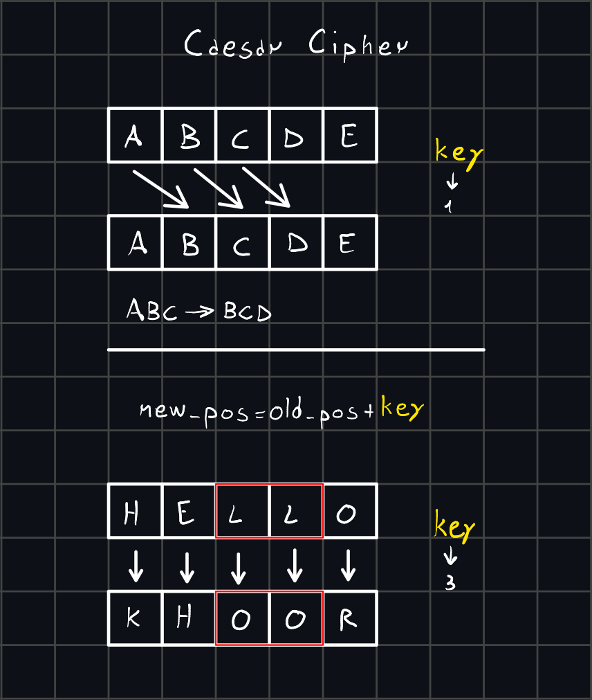
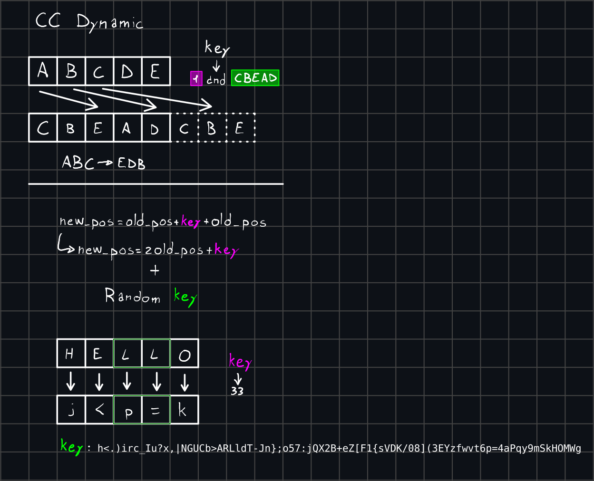
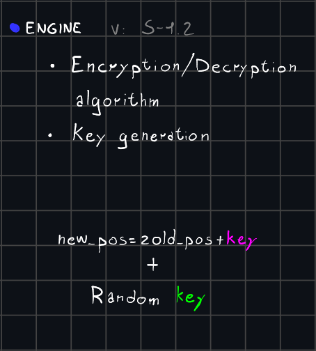
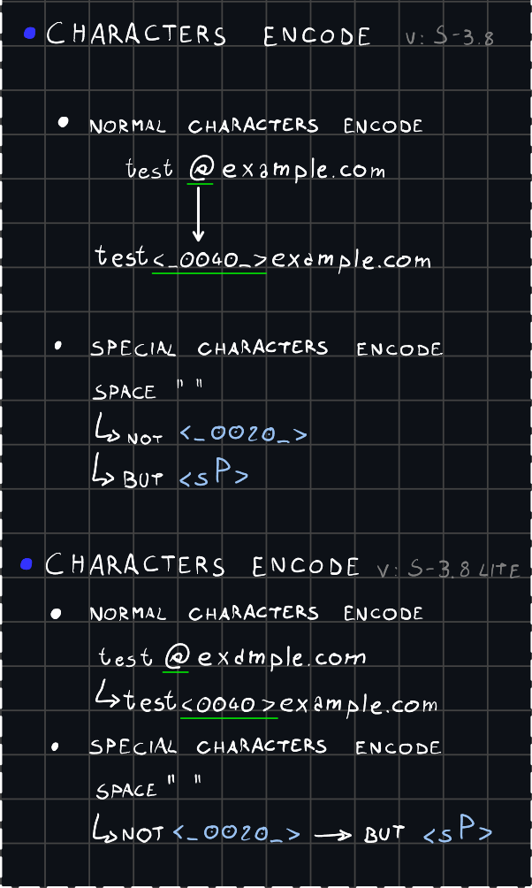
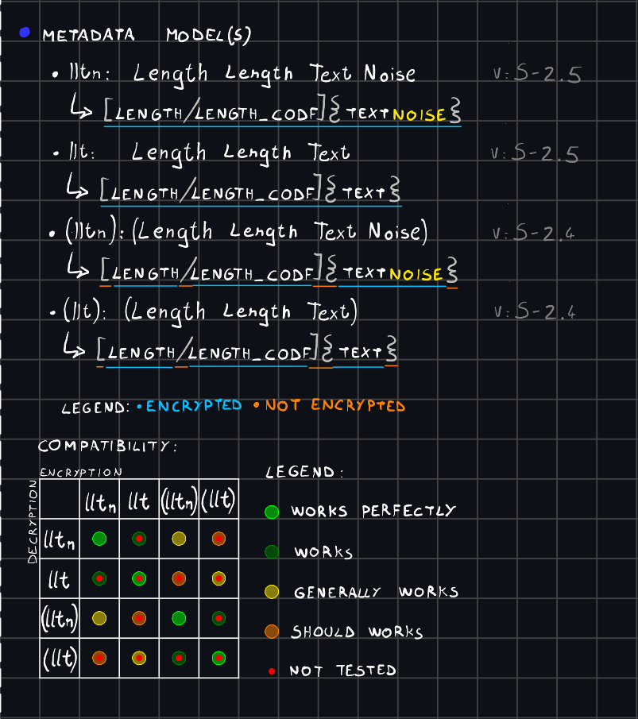
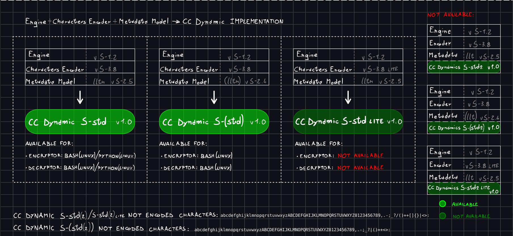

# CC Dynamic - text encryption-decription algorithm

## CC Dynamic is a text encryption algorithm that is based on the Caesar Cipher.

But it offers much stronger encryption than the original, solving its biggest problem: **common letter patterns**.

### How does the Caesar Cipher work?

The Caesar Cipher is one of the oldest forms of cryptography, used by the eponymous leader for his correspondence. The algorithm involves replacing each letter of the original message (plaintext) with the letter found *`n`* positions to the right in the alphabet. In this case, *`n`* is the ***key***.

The most obvious problem is that identical letters in the original text correspond to identical letters in the ciphertext. For example `HELLO` becomes `KHOOR` (key = 3)

You can see that the double *L* has become a double *O*. This is a pattern that allows you to bypass encryption. Modern computers, in fact, can try in a very short time all the possible combinations (keys), which in the English alphabet are 26.

Additionally, spaces between words can help find patterns and decipher the original message.

The algorithm used by the Caesar Cipher can be indicated with this expression:
`new_pos = old_pos + key`
where `new_pos` corresponds to the position in the alphabet of the "encrypted character", `old_pos` represents the position of the original character and `key` is the encryption key

### How does the CC Dynamic work?

---

Important note: It is not CC Dynamic (intended as an algorithm) that guarantees robustness, but its implementation. However, it is possible to implement the algorithm in many different ways, so this repository provides the "standard" implementations, indicated by `S-std`. You can create your own implementation, that best suits your needs. By implementation I mean a set of rules and instructions that allow who executes them to correctly encrypt and decrypt a text, in an unambiguous way. The encoding of implementations in various programming languages ​​allows developers to use CC Dynamic in their software.

Not all implementations have been codified.

---

This is the representation of the CC Dynamic algorithm:

`new_pos = old_pos + key + old_pos`

which can be summarized as:

`new_pos = 2 * old_pos + key`

The fact that the position of the encrypted character is calculated in this way ensures that identical letters in the plaintext do NOT correspond to identical letters in the ciphertext.

However, even though it is a bit more robust, this algorithm cannot guarantee a high resistance to brute force. For this reason, in all standard implementations (*S-std*) the alphabet with the letters sorted in alphabetical order is not used, but in a random order. This random string is used as the actual encryption key.

The key contains these characters in a random order:

`abcdefghijklmnopqrstuvwxyzABCDEFGHIJKLMNOPQRSTUVWXYZ0123456789,.-;_?/()=+[]{}|<>:`

This is called the engine. It is the only mandatory component to implement, as it encrypt and decrypt texts. In S-std implementations, optionally, it also generate key.

The second component used by CC Dynamic is the character encoder. This is used to process special characters (or all characters not included in the key).

The last component is the metadata model. It is used to check for encoded characters and to check that they are decoded correctly. There are several variations of metadata models, which are not completely compatible with each other.

<u>An implementation for must have two scripts: one to encrypt and one to decrypt the texts</u>.

---

### Currently, encodings are available for the following implementations:

| Name                    | Version | Platforms and languages support   |
| ----------------------- |:-------:|:--------------------------------- |
| CC Dynamic S-std        | 1.0     | Bash (*Linux*) / Python (*Linux*) |
| CC Dynamic (S-std)      | 1.0     | Bash (Linux)                      |
| CC Dynamic S-std *lite* | 1.0     | Not available                     |

---

## Disclaimer:

**The CC Dynamic algorithm and its implementations have not been approved, reviewed or evaluated by experts. No guarantee is given regarding the operation, security and resistance to any type of attack on the cryptographic system.**

**In all current implementations only the alphabet string is used as the key and the shift *n* value is static (42).**

Minor problems (omission of some "\\" character) may occur if the text to be encrypted contains one or more backslash "\\" characters.

---
